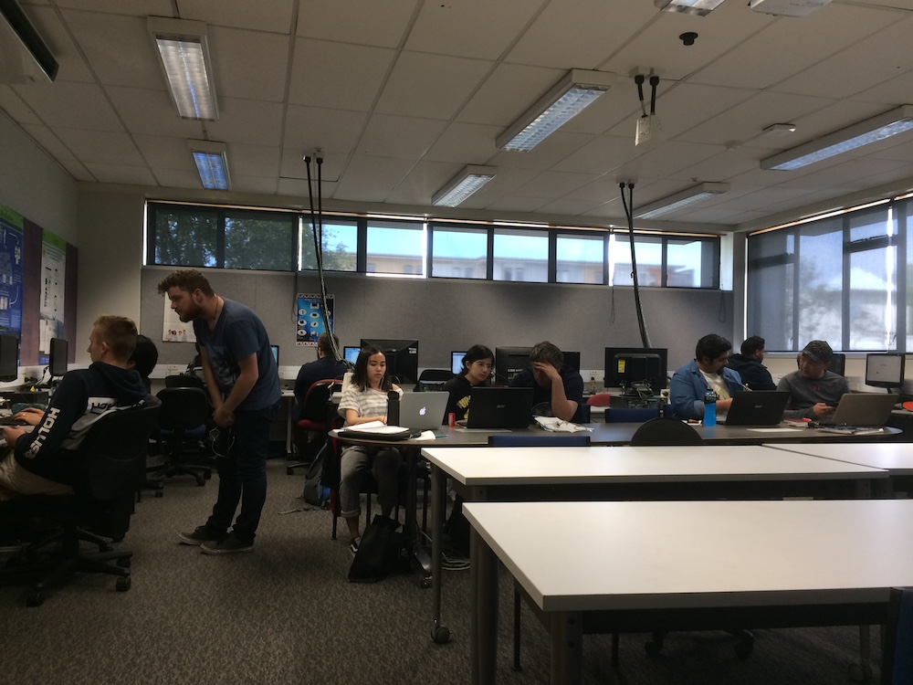

# Demonstration of teaching philosophy

My [teaching philosophy](teaching-philosophy.html) (TP) begins by describing learning as a shared process, sometimes beginning with one-way knowledge transfer but with the aim of increasing independence. This can be seen in all my lessons, but a good example is in [Multimedia](https://youtu.be/7SjdVSy-ayg) where I explain some concepts and then get the learners to build on these by doing research of their own. They share this in an online forum, and then I go through it with them to solidify and confirm the learning. 

In this same lesson are some glimpses of the coaching metaphor from my TP, but better examples are difficult to film. One of the best examples is my [lesson plan for oral presentation training](Lesson%20Plan%20PP%2013-1.pdf), which is also a good example of using active learning techniques.

Another example of applying my TP is including experiential learning. This happens in my Professional Practice class where students work on projects together to practice teamwork in an IT context, using industry tools. This is illustrated by this image of students collaborating in class.

# Integration of principles

Although this is covered in more depth in the [evidence and reflection section](evidence-reflection.html), example of principles used in my teaching include using active learning techniques (example: [active participation](https://youtu.be/dJE4mdlmKck) with learners evaluating CV examples), meeting students' future needs (example: revision conducted at the start of the [CV lesson](https://youtu.be/dJE4mdlmKck) shows learning design from earlier in the course) and time on task (boring to film, see photo above). The majority of every lesson I deliver is time spent on task. Very keen readers can see this for a few minutes during a [Multimedia lesson](https://youtu.be/wajj8LN3OSE?t=1703) in which a bit of coaching is also shown, but for the most part I turned off the camera to save the batteries during time on task.

# Reflection

I would much rather spend less time talking in many of these sessions (although for some topics it can't be avoided) however, in previous iterations of the Multimedia course in particular when I tried to adhere to my TP even more, feedback from learners was that they would much prefer more passive learning and less independence. Therefore, I am trying here to find a balance that still integrates principles of effective teaching while also leaving the students with an impression of "value for money".

